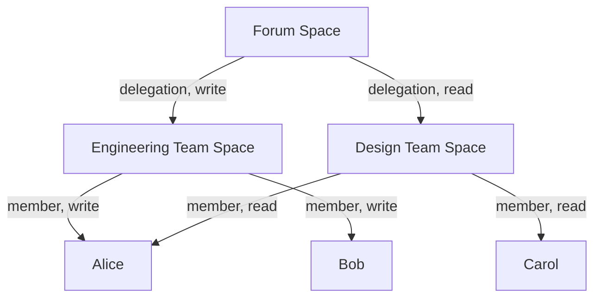

# Members

:::caution Experimental
This API is experimental and will change. See the [Permissioned Spaces overview](../spaces.md) for context.
:::

Membership determines who can read and write within a space. Members have either `read` or `write` access — write implies read.

## Adding a member

Only the space owner or a super admin can add members.

```sh
curl -X POST 'https://happyview.example.com/xrpc/dev.happyview.space.addMember' \
  -H 'X-Client-Key: hvc_...' \
  -H 'Authorization: DPoP <token>' \
  -H 'DPoP: <proof>' \
  -H 'Content-Type: application/json' \
  -d '{
    "space": "ats://did:plc:abc123/com.example.forum/main",
    "did": "did:plc:newmember",
    "access": "write",
    "isDelegation": false
  }'
```

**Input:**

| Field | Type | Required | Default | Description |
|---|---|---|---|---|
| `space` | string | Yes | | The space to add the member to |
| `did` | string | Yes | | DID of the member (or space for delegation) |
| `access` | string | No | `read` | `read` or `write` |
| `isDelegation` | boolean | No | `false` | Whether this member is a delegated space |

**Response (201):**

```json
{
  "member": {
    "id": "uuid",
    "spaceId": "space-uuid",
    "did": "did:plc:newmember",
    "access": "write",
    "isDelegation": false,
    "grantedBy": "did:plc:abc123",
    "createdAt": "2026-05-09T12:00:00Z"
  }
}
```

## Removing a member

```sh
curl -X POST 'https://happyview.example.com/xrpc/dev.happyview.space.removeMember' \
  -H 'X-Client-Key: hvc_...' \
  -H 'Authorization: DPoP <token>' \
  -H 'DPoP: <proof>' \
  -H 'Content-Type: application/json' \
  -d '{
    "space": "ats://did:plc:abc123/com.example.forum/main",
    "did": "did:plc:newmember"
  }'
```

## Listing members

```sh
curl 'https://happyview.example.com/xrpc/dev.happyview.space.listMembers?space=ats://did:plc:abc123/com.example.forum/main' \
  -H 'X-Client-Key: hvc_...' \
  -H 'Authorization: DPoP <token>' \
  -H 'DPoP: <proof>'
```

If the space's `membershipPublic` config is `true`, this endpoint is accessible without authentication. Otherwise, the caller must be authenticated and be a member.

The response returns the **resolved** member list — delegation chains are traversed and flattened:

```json
{
  "members": [
    { "did": "did:plc:abc123", "access": "write" },
    { "did": "did:plc:newmember", "access": "write" },
    { "did": "did:plc:delegated-user", "access": "read" }
  ]
}
```

## Delegation

A space can be added as a member of another space by setting `isDelegation: true`. This transitively grants access to all members of the delegated space.

```sh
curl -X POST 'https://happyview.example.com/xrpc/dev.happyview.space.addMember' \
  -H 'X-Client-Key: hvc_...' \
  -H 'Authorization: DPoP <token>' \
  -H 'DPoP: <proof>' \
  -H 'Content-Type: application/json' \
  -d '{
    "space": "ats://did:plc:abc123/com.example.forum/main",
    "did": "ats://did:plc:org/com.example.team/engineering",
    "access": "read",
    "isDelegation": true
  }'
```

Delegation chains are resolved up to 10 levels deep. When a user appears in multiple chains, the highest access level wins (`write` > `read`).

### Example: nested teams



In this example:
- Alice has `write` access (via Engineering)
- Bob has `write` access (via Engineering)
- Carol has `read` access (via Design)
- Alice also appears in Design, but `write` wins over `read`
