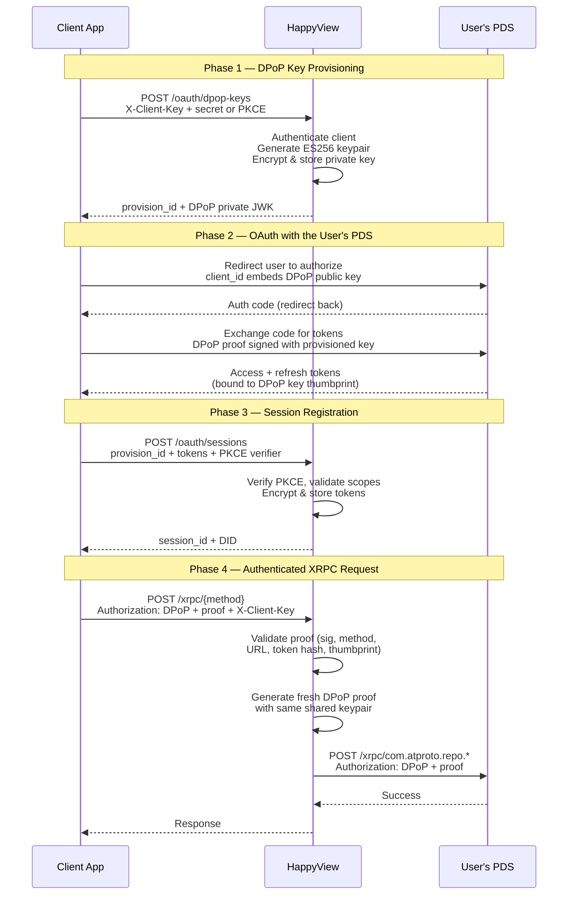

# Authentication

HappyView has two distinct authentication surfaces:

- **XRPC** (`/xrpc/*`) — client-level identification via an **API client key** on every request, plus optional user-level atproto OAuth for endpoints that need a specific user's identity (e.g. procedures that write to a PDS).
- **Admin API** (`/admin/*`) — user-level authentication via admin API keys or service auth JWTs, gated by [permissions](../guides/admin/permissions.md).

## Which endpoints require what?

| Endpoint type                      | Client identification   | User authentication                                                                                 |
| ---------------------------------- | ----------------------- | --------------------------------------------------------------------------------------------------- |
| Queries (`GET /xrpc/{method}`)     | `X-Client-Key` required | Optional — DPoP auth if the query needs to know who the user is                                     |
| Procedures (`POST /xrpc/{method}`) | `X-Client-Key` required | Required — DPoP auth so HappyView can proxy writes to the user's PDS                                |
| Admin API (`/admin/*`)             | —                       | Required — admin API key or service auth JWT with the right [permissions](../guides/admin/permissions.md) |
| Health check (`GET /health`)       | —                       | —                                                                                                   |

## XRPC: API client identification

Every XRPC request — including unauthenticated `GET` queries — must identify itself with a registered API client. The client key is HappyView's rate-limit bucket key and its way of knowing who is calling. A request without one returns `401 Unauthorized` with `Missing client identification`.

Register a client in the dashboard (**Settings > API Clients > New client**) or via `POST /admin/api-clients`. You'll get back an `hvc_…` client key and an `hvs_…` client secret — **the secret is only shown once**, so capture it immediately.

HappyView resolves the client key from the first of:

1. The `X-Client-Key` request header.
2. A `client_key` query-string parameter.

On top of the client key, HappyView does best-effort validation that the caller actually controls the client:

- If an `Origin` header is present (typical for browser apps), it must match the client's registered `client_uri`.
- Otherwise, an `X-Client-Secret` header may be supplied and must match the stored secret (typical for server-to-server callers).

Both checks currently log warnings on mismatch rather than rejecting the request, but the intent is clear: don't share client keys, and treat the secret like a password.

### Calling a query

```sh
curl 'https://happyview.example.com/xrpc/com.example.feed.getHot' \
  -H 'X-Client-Key: hvc_a1b2c3...'
```

For a server-to-server integration, add the secret:

```sh
curl 'https://happyview.example.com/xrpc/com.example.feed.getHot' \
  -H 'X-Client-Key: hvc_a1b2c3...' \
  -H 'X-Client-Secret: hvs_d4e5f6...'
```

### Authenticating users for procedures

Queries that don't care who is calling need nothing more than the client key. Procedures — and queries whose Lua scripts read the caller's DID — need a real atproto OAuth session.

XRPC routes only accept **DPoP auth** (`Authorization: DPoP <token>` + `DPoP` proof header + `X-Client-Key`). Bearer tokens and service auth JWTs are not accepted on XRPC endpoints.

Third-party apps authenticate users through the [DPoP key provisioning](#dpop-key-provisioning-for-third-party-apps) flow: your app gets a DPoP keypair from HappyView, runs a standard OAuth flow with the user's PDS using that keypair, then registers the resulting tokens back with HappyView.

The [JavaScript SDK](../sdk/overview.md) handles this entire flow for you:

```typescript
import { Client } from "@atproto/lex";
import { HappyViewBrowserClient } from "@happyview/oauth-client-browser";
import { createAgent } from "@happyview/lex-agent";

const oauthClient = new HappyViewBrowserClient({
  instanceUrl: "https://happyview.example.com",
  clientKey: "hvc_your_client_key",
});

// Login — redirects to the user's PDS for authorization
await oauthClient.login("alice.bsky.social");

// On /oauth/callback — complete the token exchange
const session = await oauthClient.callback();

// Create a type-safe Lex client
const agent = createAgent(session);
const lex = new Client(agent);

// Make authenticated XRPC calls
await lex.xrpc(myLexicons.com.example.createPost, {
  input: { text: "Hello from HappyView!" },
});
```

For procedures, HappyView proxies the write to the user's PDS using the stored OAuth session (see [Proxying procedures](#proxying-procedures-to-the-users-pds) below).

## Admin API: user authentication

Admin endpoints don't use API clients. They require a real HappyView user, identified by one of two methods:

### Admin API key

For automation — CI/CD, monitoring, cron jobs — create an [admin API key](../guides/admin/api-keys.md) at **Settings > API Keys** or via `POST /admin/api-keys` and pass it as a bearer token:

```sh
export TOKEN="hv_your-api-key-here"
curl http://localhost:3000/admin/lexicons \
  -H "Authorization: Bearer $TOKEN"
```

A key only carries the permissions selected at creation time and can never exceed the permissions of the user who created it. Admin API keys are not valid for XRPC endpoints — they exist solely for admin API access.

### Service auth JWT

HappyView also accepts standard atproto inter-service auth JWTs in the `Authorization` header. Another AppView, relay, or PDS can sign a short-lived ES256 or ES256K JWT with its DID's signing key; HappyView resolves the issuer's DID document, verifies the signature against the `#atproto` verification method, and treats the issuer DID as the caller identity.

For a service auth JWT to validate:

- `alg` must be `ES256` or `ES256K`.
- `typ` must not be `at+jwt`, `refresh+jwt`, or `dpop+jwt` (those are other token types, not inter-service JWTs).
- `exp` must be in the future.
- The signature must verify against the issuer DID's atproto signing key.

As with the other methods, the resolved DID still has to exist in the HappyView `users` table with the right permissions to hit admin endpoints — service auth gets you identified, not privileged.

### Admin access and the first user

On a fresh deployment, the `users` table is empty. The first authenticated request to any admin endpoint auto-bootstraps that user as the **super user** with all permissions granted. This includes logging in to the dashboard — the dashboard makes admin API calls on your behalf, so the first person to log in becomes the super user.

To add more users after that, use `POST /admin/users` or the [dashboard](dashboard.md). You can assign permissions individually or use a template (`viewer`, `operator`, `manager`, `full_access`). See [Admin API — Users](../reference/admin/users.md) for details.

## Proxying procedures to the user's PDS

When a client calls an XRPC procedure that writes a record, HappyView proxies the write to the user's PDS. This requires a DPoP-authenticated session — the app must have gone through the [DPoP key provisioning](#dpop-key-provisioning-for-third-party-apps) flow and registered tokens for the user. HappyView uses the app's provisioned DPoP key to generate fresh proofs and attach the stored access token to the outbound PDS request.

A request that only carries an `X-Client-Key` header (no DPoP token) can hit queries but can't proxy writes — there's no user to write as.

## DPoP key provisioning for third-party apps

Third-party apps that want HappyView to make PDS writes on behalf of their users use the **DPoP key provisioning** flow. This avoids browser-based redirects through HappyView's domain, which can be blocked by Firefox's Bounce Tracker Protection.

The idea: the app gets a DPoP keypair from HappyView, uses that keypair during its own OAuth flow with the user's PDS, then registers the resulting tokens back with HappyView. From that point on, XRPC requests authenticated with `Authorization: DPoP <access_token>` plus a `DPoP` proof header and `X-Client-Key` will have HappyView proxy writes using the stored session.

The client app and HappyView share the same DPoP keypair, so both can generate valid proofs that the PDS will accept. The PDS binds tokens to a key's thumbprint but it doesn't care who signs the proof, only that it was signed by the right key.

### Flow overview



:::tip
The [JavaScript SDK](../sdk/overview.md) handles this entire flow for you. The raw HTTP flow below is useful for understanding the protocol or building a non-JavaScript client.
:::

### API clients: confidential vs public

API clients have a `client_type` field — either `confidential` (default) or `public`.

- **Confidential clients** authenticate with `X-Client-Key` + `X-Client-Secret` headers on every `/oauth/*` request.
- **Public clients** (browser apps that can't keep a secret) authenticate with `X-Client-Key` header + PKCE. The app sends a `pkce_challenge` (S256) in the body when provisioning a key, then proves possession with `pkce_verifier` when registering a session. Public clients also have `allowed_origins` — the `Origin` header must match.

### The full flow

#### 1. Provision a DPoP key

```
POST /oauth/dpop-keys
X-Client-Key: hvc_...
X-Client-Secret: hvs_...
Content-Type: application/json

{}
```

For public clients, omit `X-Client-Secret` and include the PKCE challenge in the body:

```
POST /oauth/dpop-keys
X-Client-Key: hvc_...
Origin: http://localhost:3000
Content-Type: application/json

{ "pkce_challenge": "base64url..." }
```

Response:

```json
{
  "provision_id": "hvp_...",
  "dpop_key": {
    "kty": "EC",
    "crv": "P-256",
    "x": "...",
    "y": "...",
    "d": "..."
  }
}
```

The `dpop_key` is the private JWK. Use it to generate DPoP proofs during your OAuth flow with the user's PDS.

#### 2. Run OAuth with the user's PDS

Use the provisioned DPoP key as your DPoP keypair in a standard atproto OAuth flow with the user's PDS. HappyView is not involved in this step — the app talks directly to the PDS authorization server.

#### 3. Register the session

After the OAuth callback, register the token set with HappyView:

```
POST /oauth/sessions
X-Client-Key: hvc_...
X-Client-Secret: hvs_...
Content-Type: application/json

{
  "provision_id": "hvp_...",
  "did": "did:plc:user123",
  "access_token": "...",
  "refresh_token": "...",
  "expires_at": "2026-04-17T00:00:00Z",
  "scopes": "atproto transition:generic",
  "pds_url": "https://bsky.social",
  "issuer": "https://bsky.social"
}
```

For public clients, omit `X-Client-Secret` and include the PKCE verifier in the body:

```json
{
  "provision_id": "hvp_...",
  "pkce_verifier": "...",
  "did": "did:plc:user123",
  "access_token": "...",
  "refresh_token": "...",
  "expires_at": "2026-04-17T00:00:00Z",
  "scopes": "atproto transition:generic",
  "pds_url": "https://bsky.social",
  "issuer": "https://bsky.social"
}
```

Response:

```json
{
  "session_id": "uuid",
  "did": "did:plc:user123"
}
```

#### 4. Make XRPC requests

With a registered session, send XRPC requests using DPoP auth:

```sh
curl -X POST 'https://happyview.example.com/xrpc/com.example.feed.createPost' \
  -H 'X-Client-Key: hvc_...' \
  -H 'Authorization: DPoP <access_token>' \
  -H 'DPoP: <proof_jwt>' \
  -H 'Content-Type: application/json' \
  -d '{"text": "Hello world"}'
```

HappyView validates the DPoP proof, looks up the stored session, and proxies the write to the user's PDS using the provisioned DPoP key to generate a fresh proof.

#### 5. Logout

Confidential clients authenticate with `X-Client-Key` + `X-Client-Secret`:

```
DELETE /oauth/sessions/did:plc:user123
X-Client-Key: hvc_...
X-Client-Secret: hvs_...
```

Public clients must provide a valid DPoP proof to prove they hold the key:

```
DELETE /oauth/sessions/did:plc:user123
X-Client-Key: hvc_...
Authorization: DPoP <access_token>
DPoP: <proof_jwt>
```

This deletes the stored session and the associated DPoP key.

### Security notes

- Private keys and tokens are encrypted at rest with AES-256-GCM using `TOKEN_ENCRYPTION_KEY`.
- DPoP proofs are validated for method, URL, timestamp (5-minute window), access token binding, and JWK thumbprint.
- Scopes requested must include `atproto` and must be a subset of the API client's registered scopes.

## Next steps

- [JavaScript SDK](../sdk/overview.md) — authenticate and make XRPC calls from JavaScript
- [Permissions](../guides/admin/permissions.md) — full list of permissions and what each one grants
- [API Keys](../guides/admin/api-keys.md) — create scoped admin API keys for automation
- [Admin API — API Clients](../reference/admin/api-clients.md) — register API clients and configure rate limits
